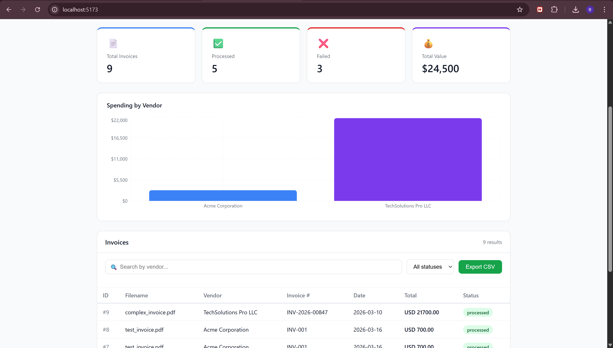
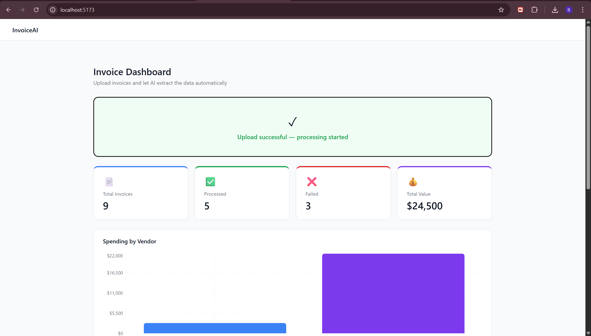
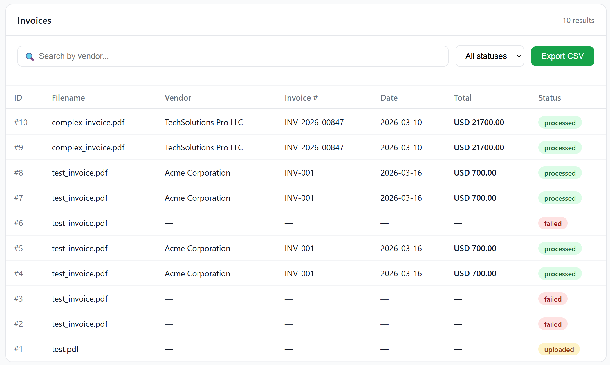
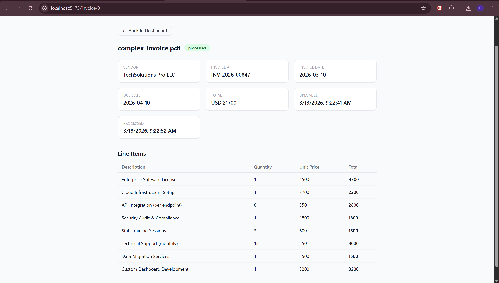
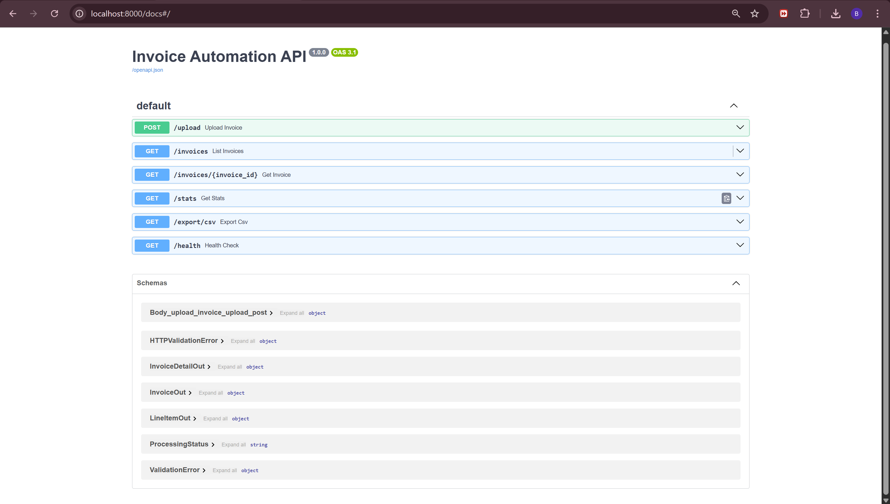

# InvoiceAI — Automated Invoice Processing System

> An AI-powered document automation system that extracts structured
> data from PDF and image invoices using OCR and GPT-4o-mini —
> eliminating manual data entry for finance teams.



---

## The Problem This Solves

Businesses receive hundreds of invoices monthly in inconsistent
formats. Manually extracting vendor names, totals, dates, and line
items is slow, error-prone, and expensive — costing $15–40 per
invoice in labor time.

This system automates the entire extraction pipeline in under
10 seconds per invoice.

---

## Features

- **Drag-and-drop upload** — PDF, PNG, and JPG invoices accepted
- **Dual-mode OCR** — native text extraction for digital PDFs, Tesseract fallback for scanned documents
- **AI extraction** — GPT-4o-mini identifies vendor, invoice number, date, total, currency, and line items
- **Real-time status tracking** — uploaded → processing → processed → failed
- **Analytics dashboard** — stats cards and vendor spending chart
- **Search and filter** — filter by vendor name or processing status
- **CSV export** — one-click export of all processed invoices
- **Full REST API** — documented with Swagger UI

---

## Screenshots

### Dashboard


### Invoice Upload


### Processed Invoices Table


### Invoice Detail View


### API Documentation


---

## Tech Stack

| Layer | Technology | Purpose |
|---|---|---|
| Backend | Python 3, FastAPI | REST API and background processing |
| AI | OpenAI GPT-4o-mini | Structured data extraction |
| OCR | pdfplumber, pytesseract | Text extraction from documents |
| Database | SQLite + SQLAlchemy | Invoice data storage |
| Frontend | React 18, Vite | Dashboard interface |
| Charts | Recharts | Vendor spending visualization |

---

## System Architecture

```
┌─────────────────────────────────────────┐
│           React Frontend                │
│  Upload → Table → Detail → Export       │
└──────────────────┬──────────────────────┘
                   │ REST API
┌──────────────────▼──────────────────────┐
│           FastAPI Backend               │
│  /upload  /invoices  /stats  /export    │
└──────┬──────────────────────────────────┘
       │
       ▼
┌─────────────────────────────────────────┐
│         Processing Pipeline             │
│  1. OCR (pdfplumber / Tesseract)        │
│  2. AI Extraction (GPT-4o-mini)         │
│  3. Validation & Database Write         │
└──────────────────┬──────────────────────┘
                   │
┌──────────────────▼──────────────────────┐
│         SQLite Database                 │
│  invoices table + line_items table      │
└─────────────────────────────────────────┘
```

**Key design decisions:**
- Processing runs as a FastAPI background task — the user gets an immediate 202 response while AI extraction happens asynchronously
- OCR uses native PDF text extraction first (fast, accurate), falling back to Tesseract only for scanned documents
- Raw OCR text is stored alongside extracted fields for debugging

---

## Local Setup

### Prerequisites
- Python 3.10+
- Node.js 18+
- OpenAI API key (get one at platform.openai.com)

### 1. Clone the repository
```bash
git clone https://github.com/BadrDyane/invoice-automation.git
cd invoice-automation
```

### 2. Backend setup
```bash
cd backend
python -m venv venv

# Mac/Linux
source venv/bin/activate

# Windows
venv\Scripts\activate

pip install -r requirements.txt
cp .env.example .env
```

Open `.env` and add your OpenAI API key:
```
OPENAI_API_KEY=sk-your-key-here
```

Start the backend:
```bash
uvicorn main:app --reload
```

API documentation available at: http://localhost:8000/docs

### 3. Frontend setup
```bash
cd frontend
npm install
npm run dev
```

Open http://localhost:5173

---

## API Endpoints

| Method | Endpoint | Description |
|---|---|---|
| `POST` | `/upload` | Upload an invoice file |
| `GET` | `/invoices` | List all invoices (supports filtering) |
| `GET` | `/invoices/{id}` | Get single invoice with line items |
| `GET` | `/stats` | Dashboard statistics and vendor totals |
| `GET` | `/export/csv` | Download all processed invoices as CSV |
| `GET` | `/health` | Health check |

---

## Project Structure

```
invoice-automation/
├── backend/
│   ├── api/routes/          # FastAPI route handlers
│   │   ├── upload.py        # File upload endpoint
│   │   ├── invoices.py      # Invoice CRUD endpoints
│   │   └── export.py        # CSV export endpoint
│   ├── database/            # SQLAlchemy models and schemas
│   │   ├── models.py        # Invoice and LineItem models
│   │   ├── schemas.py       # Pydantic response schemas
│   │   └── crud.py          # Database operations
│   ├── services/            # Business logic
│   │   ├── ocr_service.py   # PDF and image text extraction
│   │   └── ai_service.py    # GPT-4o-mini extraction
│   ├── processing/
│   │   └── pipeline.py      # Full processing orchestration
│   ├── config.py            # Environment configuration
│   └── main.py              # FastAPI app entry point
└── frontend/
    └── src/
        ├── components/      # Reusable UI components
        │   ├── UploadZone.jsx
        │   ├── InvoiceTable.jsx
        │   ├── StatsCards.jsx
        │   ├── VendorChart.jsx
        │   └── FilterBar.jsx
        ├── pages/           # Route-level pages
        │   ├── Dashboard.jsx
        │   └── InvoiceDetail.jsx
        └── api/
            └── client.js    # Axios API client
```

---

## How the AI Extraction Works

1. The uploaded file is saved to disk and a database record is created
2. FastAPI triggers the processing pipeline as a background task
3. pdfplumber attempts native text extraction from the PDF
4. If no text is found (scanned document), PyMuPDF renders pages as images and Tesseract performs OCR
5. The raw text is sent to GPT-4o-mini with a structured prompt requesting JSON output
6. The response is parsed and saved to the database with all extracted fields
7. The invoice status updates to `processed` (or `failed` with an error message if extraction fails)

---

## Potential Extensions

This system could be extended into a production product by adding:

- **Email integration** — auto-process invoices received by email
- **QuickBooks / Xero export** — push extracted data directly to accounting software
- **Approval workflow** — route invoices for human review before posting
- **Multi-tenant support** — separate workspaces per company
- **Batch processing** — upload and process multiple invoices at once
- **Webhook notifications** — notify external systems when processing completes

---

## Author

**Badr Dyane**
Full-Stack Developer | AI & Automation
[GitHub](https://github.com/BadrDyane)

---

*Built as part of a freelance portfolio demonstrating AI integration,
automation pipelines, and full-stack development.*
